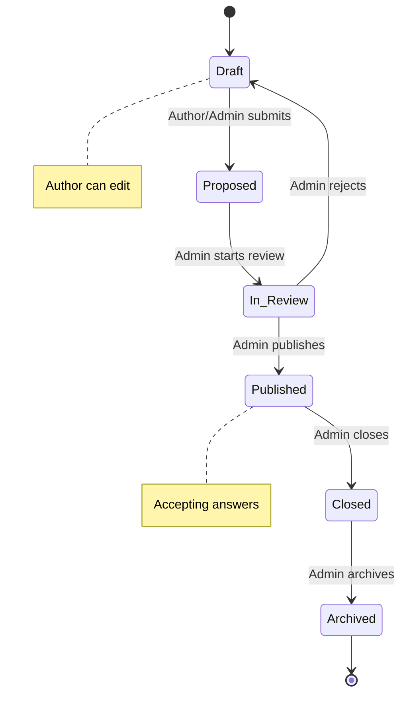
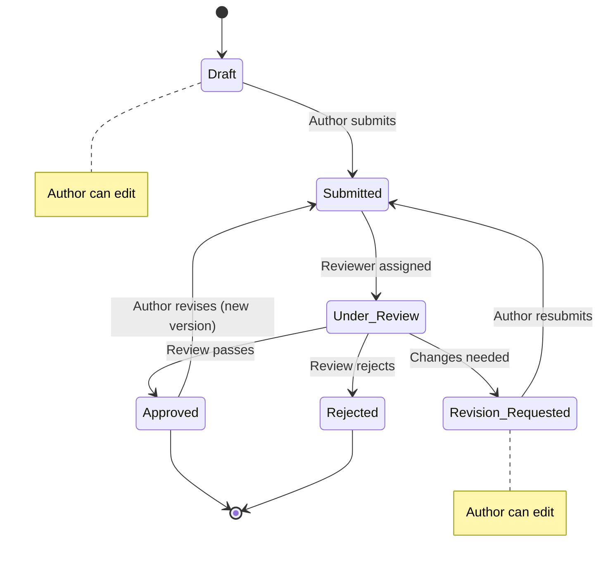

# Knowledge Elicitation Platform

A collaborative platform for capturing, reviewing, and refining organizational tacit knowledge through structured question-answer workflows with peer review cycles.

## Quick Start

```bash
make setup   # interactive — generates .env, starts services, creates service account
```

Or manually:

```bash
cp .env.example .env
docker compose up --build
```

Open http://localhost:5173 and click **Sign in as Test User** to log in as a dev admin.

## Architecture

| Service | Tech | Port | Profile |
|---------|------|------|---------|
| **api** | FastAPI + SQLAlchemy (async) | 8000 | default |
| **web** | React 18 + TypeScript + Vite | 5173 | default |
| **worker** | FastAPI + litellm (LLM tasks) | 8001 | default |
| **db** | PostgreSQL 16 + pgvector | 5432 | default |
| **embedding** | llama.cpp (bge-m3 Q8_0) | 8090 | `embedding` |

Migrations run automatically on container start via Alembic. The worker and embedding services are optional — the platform functions fully without them.

> [!WARNING]
> The `embedding` Docker Compose service runs **CPU-only inference**. This is sufficient for typical workloads (a few embeddings per minute), but if you have a GPU available, use a GPU-accelerated setup instead for better throughput. See [Embeddings Setup](docs/embeddings.md#gpu-alternatives) for CUDA, Metal, ROCm, and cloud options.

## Development

```bash
make setup          # interactive first-time setup (generates .env, starts stack)
make up             # start core services (db, api, web, worker)
make test           # run backend tests
make migrate        # run database migrations manually
make logs           # follow container logs
make shell          # open bash in api container
make seed           # seed database with sample data (5 users, 5 questions)
make test-e2e       # run Playwright end-to-end tests
make down           # stop everything

# Backup & restore
make backup        # trigger manual database backup
make restore       # restore from latest backup
make backup-verify # verify latest backup integrity

# Embedding server (optional — for embedding-based recommendations)
make embed-download # download bge-m3 model (~605MB)
make up-embed       # start all services + embedding server
make embed-status   # check embedding server health
```

### Embedding quick start

To enable embedding-based recommendations (optional):

```bash
pip install huggingface_hub          # one-time dependency for model download
make embed-download                  # download bge-m3 Q8_0 (~605MB)
echo 'EMBEDDING_MODEL=openai/bge-m3
EMBEDDING_API_BASE=http://embedding:8090/v1/
EMBEDDING_API_KEY=no-key' >> .env
make up-embed                        # start all services + embedding server
```

See [Embeddings Setup](docs/embeddings.md) for GPU alternatives and cloud options.

### Running specific tests

```bash
docker compose exec api pytest tests/test_auth.py -xvs
```

## Authentication

- **Production**: Google OAuth — set `GOOGLE_CLIENT_ID` and `GOOGLE_CLIENT_SECRET` in `.env`
- **Local dev**: click **Sign in as Test User** (available when `DEV_LOGIN_ENABLED` is true, which is the default)
- **Service accounts**: authenticate via `X-API-Key` header

## Configuration

See `.env.example` for all environment variables. Key settings:

| Variable | Purpose | Default |
|----------|---------|---------|
| `DATABASE_URL` | PostgreSQL connection string | `postgresql+asyncpg://app:devpassword@db:5432/knowledge_elicitation` |
| `JWT_SECRET` | Token signing key (min 32 bytes) | `dev-secret-change-me-at-least-32b` |
| `GOOGLE_CLIENT_ID` | Google OAuth client ID (empty = dev login enabled) | empty |
| `GOOGLE_CLIENT_SECRET` | Google OAuth client secret | empty |
| `GOOGLE_REDIRECT_URI` | OAuth redirect URI (must match GCP config) | empty |
| `BOOTSTRAP_ADMIN_EMAIL` | Email that auto-receives all roles on first login | empty |
| `DEV_LOGIN_ENABLED` | Enable dev login endpoint | `true` |
| `CORS_ORIGINS` | Allowed frontend origins | `["http://localhost:5173"]` |
| `WORKER_URL` | LLM worker service URL (empty = disabled) | empty |
| `ANTHROPIC_API_KEY` | Anthropic API key for LLM tasks | empty |
| `LLM_MODEL` | litellm model identifier for the worker | `anthropic/claude-sonnet-4-6` |
| `EMBEDDING_MODEL` | Embedding model for pgvector (empty = disabled) | empty |
| `WORKER_API_KEY` | Service account API key for the worker | empty |

## AI Integration

The platform includes optional LLM-powered capabilities via a separate worker service:

| Capability | Trigger | Description |
|-----------|---------|-------------|
| **Question generation** | Admin on-demand | Generate elicitation questions for a topic/domain |
| **Answer option scaffolding** | Auto on publish or on-demand | Generate up to 4 maximally distinct answer options (replaces existing options each run) |
| **Review assistance** | Auto on submit or on-demand | AI-assisted preliminary review with confidence scoring |
| **Question extraction** | Admin on-demand | Extract elicitation questions from a source document via two-pass LLM (chunk extraction + consolidation) |
| **Respondent recommendation** | On-demand | Embedding similarity (pgvector) or LLM-based scoring (Haiku) — configurable via `RECOMMENDATION_STRATEGY` |

#### Recommendation Strategy

| Strategy | Set in `.env` | What it does | Requirements |
|----------|--------------|--------------|--------------|
| `auto` (default) | `RECOMMENDATION_STRATEGY=auto` | Uses embeddings if `EMBEDDING_MODEL` is set, otherwise falls back to LLM | Either embedding or worker infra |
| `llm` | `RECOMMENDATION_STRATEGY=llm` | Sends candidate answer history to Haiku for scoring | `WORKER_URL` + `ANTHROPIC_API_KEY` |
| `embedding` | `RECOMMENDATION_STRATEGY=embedding` | pgvector cosine similarity on answer embeddings | `EMBEDDING_MODEL` + embedding server |

**Quickest setup** (no GPU needed): set `RECOMMENDATION_STRATEGY=llm` and configure `WORKER_URL` + `ANTHROPIC_API_KEY`. The worker defaults to `anthropic/claude-haiku-4-5-20251001` — override with `RECOMMENDATION_MODEL` if desired.

### Setup

1. Set `ANTHROPIC_API_KEY` (or `OPENAI_API_KEY`) in `.env`
2. Create a service account with `author` and `reviewer` roles via the admin UI
3. Set the service account's API key as `WORKER_API_KEY` in `.env`
4. Restart services — the worker connects to the API as a service account

AI controls are available in the admin UI at `/admin/ai`. All worker operations are logged via the AI logging middleware.

## Workflow State Machines

### Question Lifecycle



| State | Who can edit | Notes |
|-------|-------------|-------|
| **Draft** | Author, Admin | Initial state — full editing allowed |
| **Proposed** | Admin only | Author's edit is locked while awaiting review |
| **In Review** | Admin only | Under admin evaluation |
| **Published** | Admin only | Live — accepting answers and feedback |
| **Closed** | Admin only | No new answers accepted |
| **Archived** | Nobody | Terminal state — read-only |

### Answer Lifecycle



| State | Who can edit | Notes |
|-------|-------------|-------|
| **Draft** | Author, Admin | Initial state — full editing |
| **Submitted** | Admin only | Awaiting reviewer assignment |
| **Under Review** | Admin only | Reviewer is evaluating |
| **Revision Requested** | Author, Admin | Changes needed — edit and resubmit |
| **Approved** | Nobody (use Revise) | Accepted — revision creates a new version |
| **Rejected** | Nobody | Terminal state |

### Review Verdict Flow

Reviews follow a simpler flow: **Pending** → **Approved** / **Changes Requested** / **Rejected**. Only the assigned reviewer (or an admin) can set the verdict.

## Data Export

Admin-only streaming JSONL endpoints for downstream ML consumption:

| Endpoint | Description | Use case |
|----------|-------------|----------|
| `GET /api/v1/export/training-data` | Q&A pairs with review verdicts | RAG, fine-tuning |
| `GET /api/v1/export/embeddings` | Entity embeddings (1024-dim vectors) | UMAP, clustering |
| `GET /api/v1/export/review-pairs` | Answer-review verdict pairs | RLHF, reward modeling |

All endpoints support `date_from`, `date_to`, and entity-specific filters.

## Documentation

See [`docs/`](docs/) for detailed documentation:

- [Architecture](docs/architecture.md) — system design and service boundaries
- [Data Model](docs/data-model.md) — entities, relationships, and state machines
- [API Reference](docs/api-reference.md) — all endpoints with request/response details
- [Authentication](docs/authentication.md) — auth flows, tokens, and permissions
- [Database Management](docs/database-management.md) — backups, recovery, pool tuning, monitoring, migrations
- [Development Guide](docs/development.md) — setup, testing, and workflow
- [Deployment](docs/deployment.md) — production configuration and operations

## License

Proprietary.
