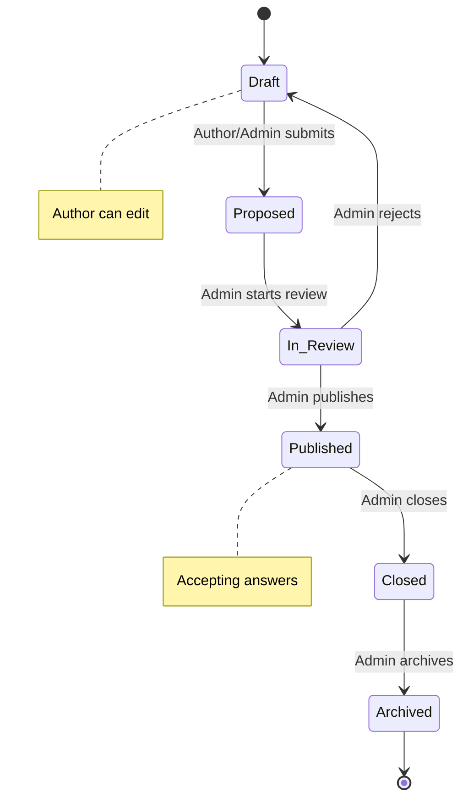
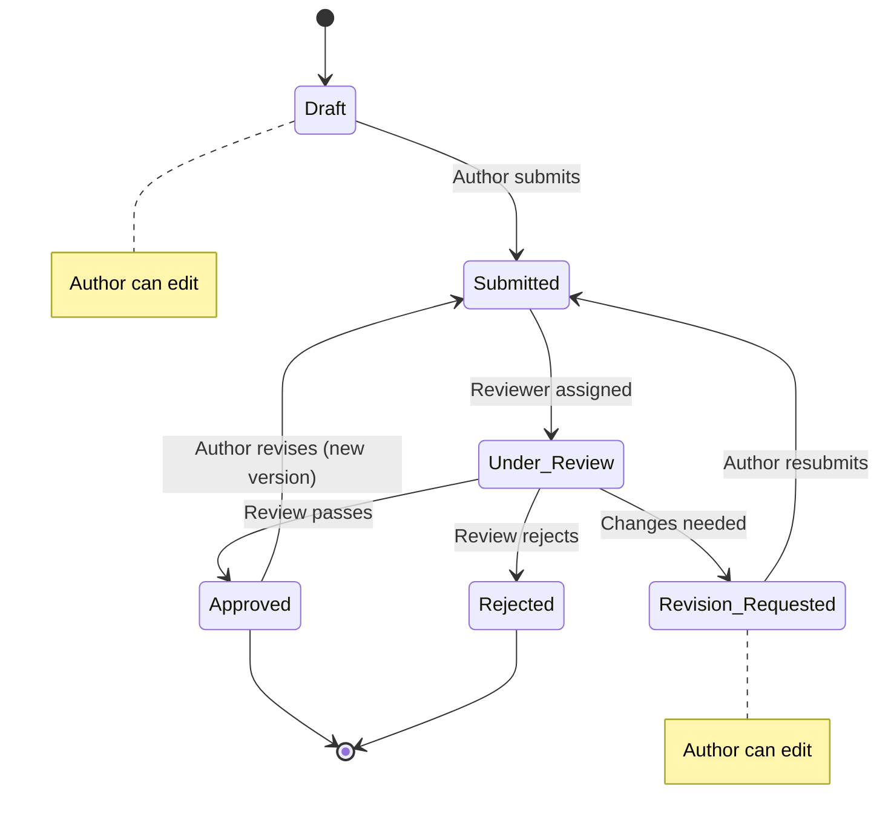

# Knowledge Elicitation Platform

A collaborative platform for capturing, reviewing, and refining organizational tacit knowledge through structured question-answer workflows with peer review cycles.

## Quick Start

```bash
cp .env.example .env
docker compose up --build
```

Open http://localhost:5173 and click **Sign in as Test User** to log in as a dev admin.

## Architecture

| Service | Tech | Port |
|---------|------|------|
| **api** | FastAPI + SQLAlchemy (async) | 8000 |
| **web** | React 18 + TypeScript + Vite | 5173 |
| **db** | PostgreSQL 16 | 5432 |

Migrations run automatically on container start via Alembic.

## Development

```bash
make up       # start all services (build + run)
make test     # run backend tests
make migrate  # run database migrations manually
make logs     # follow container logs
make shell    # open bash in api container
make down     # stop everything
```

### Running specific tests

```bash
docker compose exec api pytest tests/test_auth.py -xvs
```

## Authentication

- **Production**: Google OAuth — set `GOOGLE_CLIENT_ID` and `GOOGLE_CLIENT_SECRET` in `.env`
- **Local dev**: click **Sign in as Test User** (available when `DEV_LOGIN_ENABLED` is true, which is the default)
- **Service accounts**: authenticate via `X-API-Key` header

## Configuration

See `.env.example` for all environment variables. Key settings:

| Variable | Purpose | Default |
|----------|---------|---------|
| `DATABASE_URL` | PostgreSQL connection string | `postgresql+asyncpg://app:devpassword@db:5432/knowledge_elicitation` |
| `JWT_SECRET` | Token signing key (min 32 bytes) | `dev-secret-change-me-at-least-32b` |
| `GOOGLE_CLIENT_ID` | Google OAuth client ID (empty = dev login enabled) | empty |
| `GOOGLE_CLIENT_SECRET` | Google OAuth client secret | empty |
| `GOOGLE_REDIRECT_URI` | OAuth redirect URI (must match GCP config) | empty |
| `BOOTSTRAP_ADMIN_EMAIL` | Email that auto-receives all roles on first login | empty |
| `DEV_LOGIN_ENABLED` | Enable dev login endpoint | `true` |
| `CORS_ORIGINS` | Allowed frontend origins | `["http://localhost:5173"]` |

## Workflow State Machines

### Question Lifecycle



| State | Who can edit | Notes |
|-------|-------------|-------|
| **Draft** | Author, Admin | Initial state — full editing allowed |
| **Proposed** | Admin only | Author's edit is locked while awaiting review |
| **In Review** | Admin only | Under admin evaluation |
| **Published** | Admin only | Live — accepting answers and feedback |
| **Closed** | Admin only | No new answers accepted |
| **Archived** | Nobody | Terminal state — read-only |

### Answer Lifecycle



| State | Who can edit | Notes |
|-------|-------------|-------|
| **Draft** | Author, Admin | Initial state — full editing |
| **Submitted** | Admin only | Awaiting reviewer assignment |
| **Under Review** | Admin only | Reviewer is evaluating |
| **Revision Requested** | Author, Admin | Changes needed — edit and resubmit |
| **Approved** | Nobody (use Revise) | Accepted — revision creates a new version |
| **Rejected** | Nobody | Terminal state |

### Review Verdict Flow

Reviews follow a simpler one-shot flow: **Pending** → **Approved** / **Changes Requested** / **Rejected**. Only the assigned reviewer (or an admin) can set the verdict. Once set, the verdict is final.

## Documentation

See [`docs/`](docs/) for detailed documentation:

- [Architecture](docs/architecture.md) — system design and service boundaries
- [Data Model](docs/data-model.md) — entities, relationships, and state machines
- [API Reference](docs/api-reference.md) — all endpoints with request/response details
- [Authentication](docs/authentication.md) — auth flows, tokens, and permissions
- [Development Guide](docs/development.md) — setup, testing, and workflow
- [Deployment](docs/deployment.md) — production configuration and operations

## License

Proprietary.
