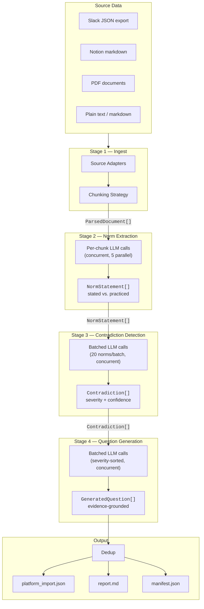
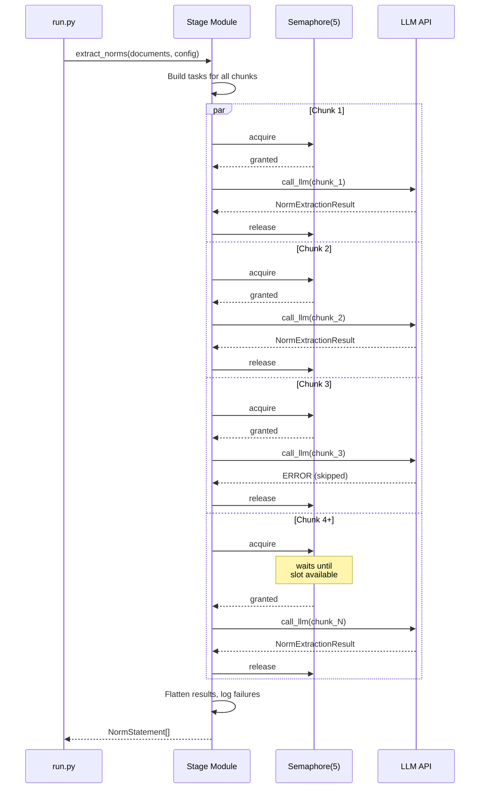
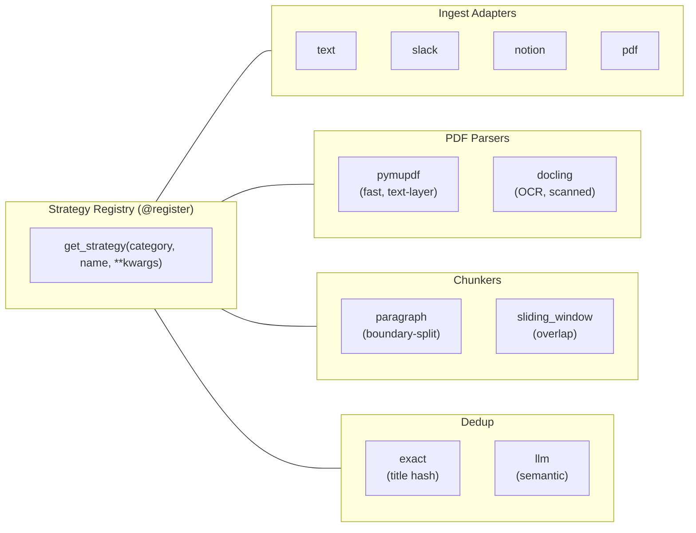
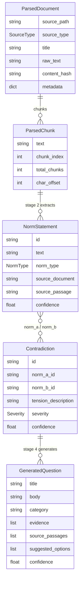

# Pipeline — Tacit Knowledge Mining

Standalone Python package (`pipeline/`) that automates knowledge elicitation: ingest organizational sources, extract norms, detect contradictions, and generate evidence-grounded questions.

## Pipeline Flow



## Stages in Detail

**Stage 1 — Ingest**: Source adapters read files and produce `ParsedDocument` objects. A chunking strategy splits each document's text into `ParsedChunk`s (~4000 chars each). Adapters and chunkers are pluggable via the strategy registry.

**Stage 2 — Norm Extraction**: For each chunk, the LLM extracts organizational norms — rules, expectations, or behavioral patterns. Each norm is classified as `stated` (from documentation) or `practiced` (observed in communication). Failed chunks are skipped without crashing the run.

**Stage 3 — Contradiction Detection**: Norms are batched (default: 20 per batch) and the LLM identifies tensions between them — e.g., documented policy says X but Slack behavior shows Y. Each contradiction has a severity level (high/medium/low) and confidence score.

**Stage 4 — Question Generation**: Contradictions are sorted by severity (high first), batched, and the LLM generates elicitation questions grounded in specific evidence. Each question includes a title, body with evidence context, category, and suggested answer options. Failed batches are skipped.

## Concurrent Execution Model

All LLM stages use `asyncio.Semaphore` + `asyncio.gather()` for parallel calls, configurable per-stage via the `concurrency` field (default: 5).



## Run Outputs

Each run creates a timestamped directory under `runs/`:

```
runs/20260315-141604-bharvest/
├── config_snapshot.yaml ··········· Frozen copy of the experiment config
├── stage_1_documents.jsonl ········ ParsedDocument list (source text + chunks)
├── stage_2_norms.jsonl ············ NormStatement list (text, type, source, confidence)
├── stage_3_contradictions.jsonl ··· Contradiction list (norm pair, tension, severity)
├── stage_4_questions.jsonl ········ GeneratedQuestion list (title, body, evidence, options)
├── export/
│   ├── platform_import.json ······· Ready for platform import
│   └── report.md ·················· Human-readable summary
└── manifest.json ·················· Timing, counts, status per stage, LLM usage/cost
```

All intermediate outputs are JSONL (one JSON object per line), so you can inspect any stage independently:

```bash
# Count norms by type
cat runs/*/stage_2_norms.jsonl | python3 -c "
import sys, json
stated = practiced = 0
for line in sys.stdin:
    n = json.loads(line)
    if n['norm_type'] == 'stated': stated += 1
    else: practiced += 1
print(f'Stated: {stated}, Practiced: {practiced}')
"

# View high-severity contradictions
cat runs/*/stage_3_contradictions.jsonl | python3 -c "
import sys, json
for line in sys.stdin:
    c = json.loads(line)
    if c['severity'] == 'high':
        print(f\"[{c['confidence']:.1f}] {c['tension_description'][:100]}\")
"
```

## Configuration

**"Change config, not code."** All experimental variables live in `configs/`:

```
configs/
├── experiments/
│   ├── default.yaml ··············· Baseline experiment config
│   └── bharvest.yaml ·············· B-Harvest-specific config (local paths)
├── prompts/
│   ├── norm_extraction/
│   │   ├── system.md ·············· System prompt (plain markdown)
│   │   └── user.md.jinja ········· User prompt (Jinja2 template)
│   ├── contradiction_detection/
│   │   ├── system.md
│   │   └── user.md.jinja
│   └── question_generation/
│       ├── system.md
│       └── user.md.jinja
└── quality_criteria.yaml ·········· Question scoring weights and thresholds
```

### Experiment YAML Reference

```yaml
experiment_name: my-experiment

sources:
  - type: slack                   # slack | notion | pdf | text
    path: /path/to/slack-export
    filters:
      channels: [general, dev]    # optional: limit to specific channels
  - type: notion
    path: /path/to/notion-export

chunking:
  strategy: paragraph             # paragraph | sliding_window
  max_chars: 4000                 # max characters per chunk
  overlap: 200                    # for sliding_window only

norm_extraction:
  model: anthropic/claude-sonnet-4-6   # any litellm-supported model
  temperature: 0.3
  max_retries: 3
  prompt_dir: norm_extraction     # subdirectory under configs/prompts/
  max_items: 0                    # 0 = unlimited
  concurrency: 5                  # parallel LLM calls

contradiction_detection:
  model: anthropic/claude-sonnet-4-6
  temperature: 0.2
  batch_size: 20                  # norms per LLM call
  concurrency: 5

question_generation:
  model: anthropic/claude-sonnet-4-6
  temperature: 0.3
  batch_size: 20                  # contradictions per LLM call
  max_items: 15                   # cap total questions generated
  concurrency: 5

dedup:
  strategy: exact                 # exact | llm
  threshold: 0.85                 # for llm dedup similarity cutoff

output:
  base_dir: runs
  export_formats:
    - platform_json
    - summary_report
```

### Prompt Templates

Prompts are Jinja2 templates. Each stage has a `system.md` (plain text) and `user.md.jinja` (template).

| Stage | Template variables |
|-------|--------------------|
| `norm_extraction` | `source_title`, `source_type`, `source_metadata`, `chunk_index`, `total_chunks`, `chunk_text` |
| `contradiction_detection` | `norms` (list of NormStatement), `batch_context` (batch position info) |
| `question_generation` | `contradictions` (list), `norm_lookup` (dict: id → NormStatement), `quality_weights` (formatted string) |

To iterate on prompts, edit the template files and re-run — no code changes needed.

### Pluggable Strategies



| Category | Strategies | Config key |
|----------|-----------|------------|
| Source ingest | `text`, `slack`, `notion`, `pdf`, `notion_mcp`\*, `slack_mcp`\* | `sources[].type` |
| PDF parsing | `pymupdf` (fast, text-layer), `docling` (OCR/scanned) | internal to pdf adapter |
| Chunking | `paragraph` (boundary-split), `sliding_window` (overlap) | `chunking.strategy` |
| Dedup | `exact` (title hash), `llm` (semantic) | `dedup.strategy` |

\* Scaffolded — registered but raise `NotImplementedError` until MCP client SDK is integrated. See `ingest/notion_mcp.py` and `ingest/slack_mcp.py` for implementation roadmap.

LLM stages are NOT strategies — they share `run_llm_stage()` and differ only in prompts and response models.

## Data Models

Defined in `pipeline/pipeline/models.py`. All are Pydantic `BaseModel` subclasses serializable to JSON.



### Field Descriptions

**ParsedDocument** (Stage 1 output)
- `source_path`: file path
- `source_type`: slack | notion | pdf | text
- `title`: document title (channel name for Slack, filename for others)
- `raw_text`: full extracted text
- `chunks`: list of `ParsedChunk` (text, chunk_index, total_chunks, char_offset)
- `metadata`: dict (e.g., `{"channel": "general"}` or `{"relative_path": "HR/policy.md"}`)
- `content_hash`: SHA256 of raw_text

**NormStatement** (Stage 2 output)
- `id`: UUID
- `text`: the norm statement
- `norm_type`: `stated` (from docs) or `practiced` (from behavior)
- `source_document`: which document it came from
- `source_passage`: exact text supporting the norm
- `confidence`: 0.0–1.0

**Contradiction** (Stage 3 output)
- `id`: UUID
- `norm_a_id`, `norm_b_id`: the two conflicting norms
- `tension_description`: explanation of the conflict
- `severity`: low | medium | high
- `confidence`: 0.0–1.0

**GeneratedQuestion** (Stage 4 output)
- `title`: the question
- `body`: context with evidence
- `category`: e.g., Authority, Communication, Process
- `evidence`: list of evidence references
- `source_passages`: exact source text
- `suggested_options`: answer choices
- `confidence`: 0.0–1.0

## Package Architecture

```
pipeline/
├── pipeline/
│   ├── __main__.py ················ python -m pipeline entry point
│   ├── run.py ····················· CLI: load config → run stages → save outputs → log usage
│   ├── config.py ·················· ExperimentConfig Pydantic model (YAML schema)
│   ├── models.py ·················· Data types: ParsedDocument, NormStatement, Contradiction, etc.
│   ├── llm.py ····················· litellm wrapper + UsageStats tracker
│   ├── registry.py ················ @register decorator + get_strategy()
│   ├── ingest/
│   │   ├── base.py ················ SourceAdapter protocol
│   │   ├── runner.py ·············· Dispatches to registered adapters + applies chunking
│   │   ├── text.py ················ Plain text / markdown adapter
│   │   ├── slack.py ··············· Slack JSON export adapter (channel dirs → messages)
│   │   ├── notion.py ·············· Notion markdown export adapter (recursive .md walk)
│   │   ├── pdf.py ················· PDF adapter (delegates to registered PDF parser)
│   │   ├── notion_mcp.py ·········· Notion MCP adapter (scaffolded, TODO)
│   │   └── slack_mcp.py ··········· Slack MCP adapter (scaffolded, TODO)
│   ├── parsers/
│   │   ├── base.py ················ PdfParser protocol
│   │   ├── pymupdf_strategy.py ···· Fast text-layer parser (PyMuPDF)
│   │   └── docling_strategy.py ···· CV/ML parser for scanned docs (optional dep)
│   ├── chunking/
│   │   ├── base.py ················ Chunker protocol
│   │   ├── runner.py ·············· Applies configured chunker to all documents
│   │   ├── paragraph.py ·········· Paragraph-boundary splitting
│   │   └── sliding_window.py ····· Fixed-size windows with overlap
│   ├── stages/
│   │   ├── base.py ················ run_llm_stage() — Jinja2 template loader + LLM call
│   │   ├── norm_extraction.py ····· Stage 2: chunks → NormStatement[] (concurrent)
│   │   ├── contradiction_detection.py · Stage 3: norms → Contradiction[] (batched, concurrent)
│   │   └── question_generation.py · Stage 4: contradictions → GeneratedQuestion[] (batched, concurrent)
│   ├── dedup/
│   │   ├── base.py ················ DedupStrategy protocol
│   │   ├── runner.py ·············· Dispatches to registered dedup strategy
│   │   ├── exact.py ··············· Hash/title exact match
│   │   └── llm_dedup.py ·········· LLM-based semantic dedup
│   └── export/
│       ├── platform_json.py ······· Platform-importable JSON array
│       └── summary_report.py ······ Markdown run summary
└── tests/
    ├── conftest.py ················ Fixtures: configs, sample documents/norms/contradictions/questions
    ├── fixtures/ ·················· Sample Slack JSON, Notion markdown, text files
    ├── test_config.py ············· Config loading and validation
    ├── test_ingest.py ············· Source adapter tests
    ├── test_parsers.py ············ PDF parser tests
    ├── test_chunking.py ··········· Chunking strategy tests
    ├── test_stages.py ············· LLM stage tests (mocked) + concurrency tests
    ├── test_llm.py ················ JSON extraction + UsageStats tests
    ├── test_dedup.py ·············· Dedup strategy tests
    ├── test_export.py ············· Export formatter tests
    └── test_run.py ················ Integration: dry-run, end-to-end with mocked LLM
```

### Key Design Patterns

**Strategy registry** (`registry.py`): Generic `@register(category, name)` decorator. Strategies are instantiated via `get_strategy(category, name, **kwargs)`. Used for ingest adapters, PDF parsers, chunkers, and dedup — anything with genuine code-level variation.

**run_llm_stage()** (`stages/base.py`): Shared function for all LLM stages. Loads system prompt (plain markdown) and renders user prompt (Jinja2 template), then calls `call_llm()`. Stages differ only in their prompt templates and Pydantic response models.

**Concurrent execution**: All LLM stages use `asyncio.Semaphore` + `asyncio.gather()` for parallel calls. Configurable per-stage via the `concurrency` field (default: 5). Each task runs inside `async with semaphore:` to limit concurrent API calls.

**Error tolerance**: Failed LLM calls (JSON parse errors, validation errors, API errors) are caught per-chunk/per-batch and skipped with a warning. The pipeline continues and reports how many items were skipped.

**UsageStats** (`llm.py`): Thread-safe accumulator tracking input/output tokens, call count, failures, and actual cost (via `litellm.completion_cost()`). Reset per run, logged at completion, saved in manifest.

## Cost

LLM usage is tracked per run and saved in `manifest.json` under `totals.usage`:

```json
{
  "usage": {
    "input_tokens": 850000,
    "output_tokens": 320000,
    "total_tokens": 1170000,
    "calls": 295,
    "failed_calls": 3,
    "cost_usd": 5.85
  }
}
```

Cost is calculated by `litellm.completion_cost()` using its built-in pricing database — not estimated.

### Controlling Cost

- Reduce `concurrency` to slow down API calls (doesn't reduce total cost, but limits burst spend)
- Set `max_items` on stages to cap output (reduces downstream calls)
- Use `chunking.max_chars` to control chunk size (fewer, larger chunks = fewer calls)
- Filter source data: use `sources[].filters.channels` for Slack, or point at specific subdirectories
- Use a cheaper model: change `model` to e.g. `anthropic/claude-haiku-4-5-20251001`

## Testing

```bash
cd pipeline && pip install -e ".[dev]" && pytest tests/ -xvs
```

All tests run locally with mocked LLM calls. No API keys needed. Run `pytest tests/ -v` for current count.

### What is NOT Tested (Requires Manual Validation)

- **Prompt quality** — mocks verify correct wiring, not that prompts produce useful output
- **Real PDF parsing** — pymupdf is mocked; install `pymupdf` and test with actual PDFs
- **Docling OCR** — optional dependency, only the import guard is tested
- **Signal-to-noise** — whether the right source channels produce meaningful norms
