# Sequence Diagrams — User Journeys

This document maps the key user journeys through the Knowledge Elicitation Platform using Mermaid sequence diagrams.

---

## Table of Contents

1. [Authentication](#1-authentication)
2. [Question Authoring Lifecycle](#2-question-authoring-lifecycle)
3. [Admin Review & Publishing](#3-admin-review--publishing)
4. [Answering a Published Question](#4-answering-a-published-question)
5. [Peer Review of an Answer](#5-peer-review-of-an-answer)
6. [Answer Revision Cycle](#6-answer-revision-cycle)
7. [AI-Assisted Question Generation](#7-ai-assisted-question-generation)
8. [AI Answer Scaffolding (Auto-trigger on Publish)](#8-ai-answer-scaffolding-auto-trigger-on-publish)
9. [AI Review Assistance (Auto-trigger on Submit)](#9-ai-review-assistance-auto-trigger-on-submit)
10. [Respondent Recommendation](#10-respondent-recommendation)
11. [Question Extraction from Document](#11-question-extraction-from-document)
12. [Question Close & Archive Cascade](#12-question-close--archive-cascade)
13. [Service Account & API Key Auth](#13-service-account--api-key-auth)

---

## 1. Authentication

### Google OAuth Login

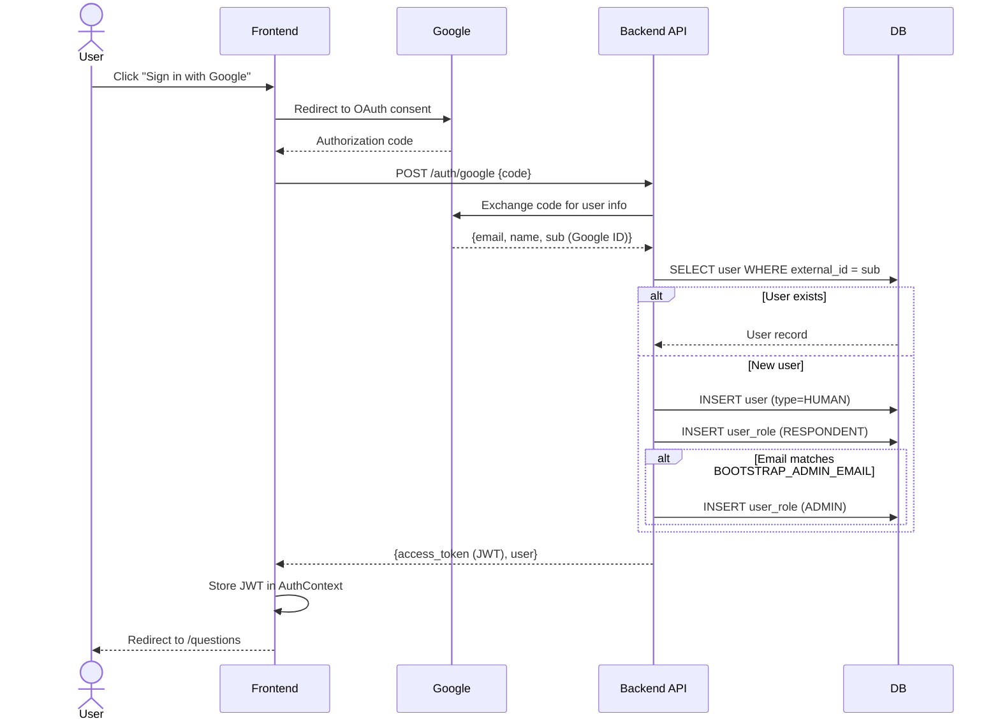
```mermaid
sequenceDiagram
    actor User
    participant Frontend
    participant Google
    participant Backend as Backend API
    participant DB

    User->>Frontend: Click "Sign in with Google"
    Frontend->>Google: Redirect to OAuth consent
    Google-->>Frontend: Authorization code
    Frontend->>Backend: POST /auth/google {code}
    Backend->>Google: Exchange code for user info
    Google-->>Backend: {email, name, sub (Google ID)}
    Backend->>DB: SELECT user WHERE external_id = sub
    alt User exists
        DB-->>Backend: User record
    else New user
        Backend->>DB: INSERT user (type=HUMAN)
        Backend->>DB: INSERT user_role (RESPONDENT)
        alt Email matches BOOTSTRAP_ADMIN_EMAIL
            Backend->>DB: INSERT user_role (ADMIN)
        end
    end
    Backend-->>Frontend: {access_token (JWT), user}
    Frontend->>Frontend: Store JWT in AuthContext
    Frontend-->>User: Redirect to /questions
```

### Dev Login (Development Only)

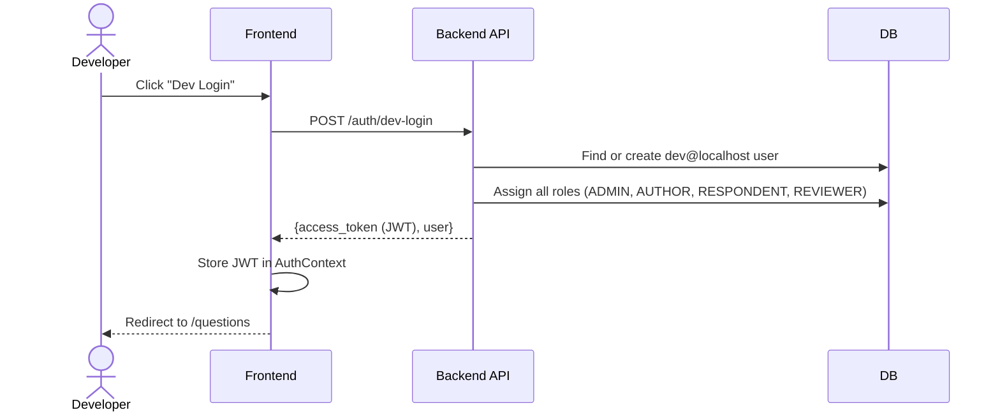
```mermaid
sequenceDiagram
    actor Dev as Developer
    participant Frontend
    participant Backend as Backend API
    participant DB

    Dev->>Frontend: Click "Dev Login"
    Frontend->>Backend: POST /auth/dev-login
    Backend->>DB: Find or create dev@localhost user
    Backend->>DB: Assign all roles (ADMIN, AUTHOR, RESPONDENT, REVIEWER)
    Backend-->>Frontend: {access_token (JWT), user}
    Frontend->>Frontend: Store JWT in AuthContext
    Frontend-->>Dev: Redirect to /questions
```

---

## 2. Question Authoring Lifecycle

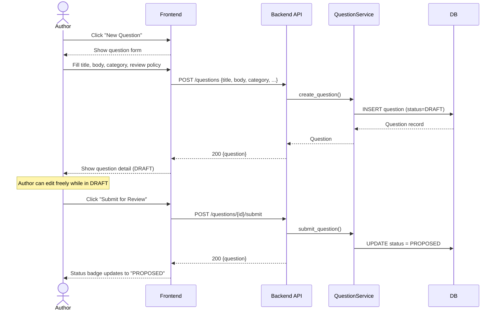
```mermaid
sequenceDiagram
    actor Author
    participant Frontend
    participant Backend as Backend API
    participant QService as QuestionService
    participant DB

    Author->>Frontend: Click "New Question"
    Frontend-->>Author: Show question form

    Author->>Frontend: Fill title, body, category, review policy
    Frontend->>Backend: POST /questions {title, body, category, ...}
    Backend->>QService: create_question()
    QService->>DB: INSERT question (status=DRAFT)
    DB-->>QService: Question record
    QService-->>Backend: Question
    Backend-->>Frontend: 200 {question}
    Frontend-->>Author: Show question detail (DRAFT)

    Note over Author: Author can edit freely while in DRAFT

    Author->>Frontend: Click "Submit for Review"
    Frontend->>Backend: POST /questions/{id}/submit
    Backend->>QService: submit_question()
    QService->>DB: UPDATE status = PROPOSED
    Backend-->>Frontend: 200 {question}
    Frontend-->>Author: Status badge updates to "PROPOSED"
```

---

## 3. Admin Review & Publishing

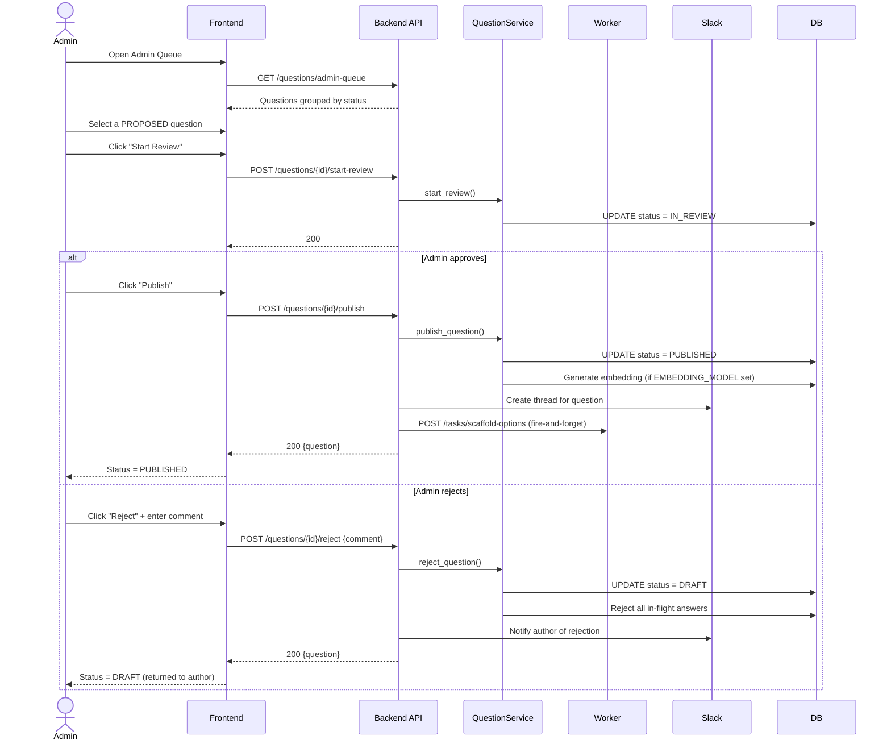
```mermaid
sequenceDiagram
    actor Admin
    participant Frontend
    participant Backend as Backend API
    participant QService as QuestionService
    participant Worker
    participant Slack
    participant DB

    Admin->>Frontend: Open Admin Queue
    Frontend->>Backend: GET /questions/admin-queue
    Backend-->>Frontend: Questions grouped by status

    Admin->>Frontend: Select a PROPOSED question
    Admin->>Frontend: Click "Start Review"
    Frontend->>Backend: POST /questions/{id}/start-review
    Backend->>QService: start_review()
    QService->>DB: UPDATE status = IN_REVIEW
    Backend-->>Frontend: 200

    alt Admin approves
        Admin->>Frontend: Click "Publish"
        Frontend->>Backend: POST /questions/{id}/publish
        Backend->>QService: publish_question()
        QService->>DB: UPDATE status = PUBLISHED
        QService->>DB: Generate embedding (if EMBEDDING_MODEL set)
        Backend->>Slack: Create thread for question
        Backend->>Worker: POST /tasks/scaffold-options (fire-and-forget)
        Backend-->>Frontend: 200 {question}
        Frontend-->>Admin: Status = PUBLISHED
    else Admin rejects
        Admin->>Frontend: Click "Reject" + enter comment
        Frontend->>Backend: POST /questions/{id}/reject {comment}
        Backend->>QService: reject_question()
        QService->>DB: UPDATE status = DRAFT
        QService->>DB: Reject all in-flight answers
        Backend->>Slack: Notify author of rejection
        Backend-->>Frontend: 200 {question}
        Frontend-->>Admin: Status = DRAFT (returned to author)
    end
```

---

## 4. Answering a Published Question

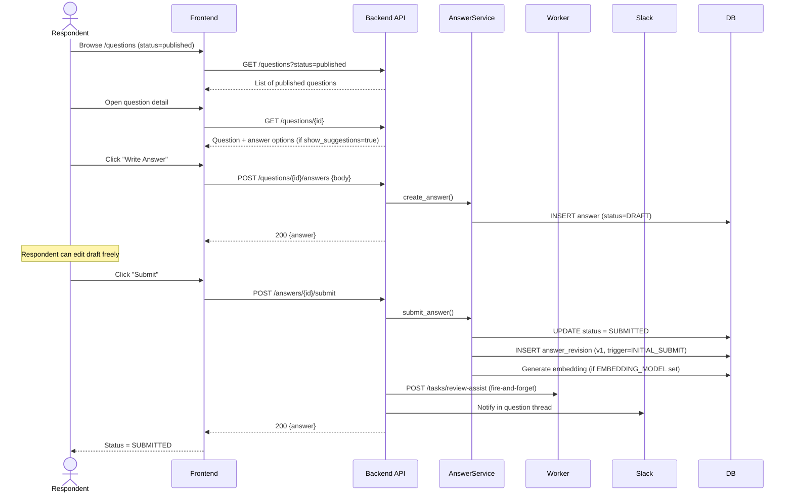
```mermaid
sequenceDiagram
    actor Respondent
    participant Frontend
    participant Backend as Backend API
    participant AService as AnswerService
    participant Worker
    participant Slack
    participant DB

    Respondent->>Frontend: Browse /questions (status=published)
    Frontend->>Backend: GET /questions?status=published
    Backend-->>Frontend: List of published questions

    Respondent->>Frontend: Open question detail
    Frontend->>Backend: GET /questions/{id}
    Backend-->>Frontend: Question + answer options (if show_suggestions=true)

    Respondent->>Frontend: Click "Write Answer"
    Frontend->>Backend: POST /questions/{id}/answers {body}
    Backend->>AService: create_answer()
    AService->>DB: INSERT answer (status=DRAFT)
    Backend-->>Frontend: 200 {answer}

    Note over Respondent: Respondent can edit draft freely

    Respondent->>Frontend: Click "Submit"
    Frontend->>Backend: POST /answers/{id}/submit
    Backend->>AService: submit_answer()
    AService->>DB: UPDATE status = SUBMITTED
    AService->>DB: INSERT answer_revision (v1, trigger=INITIAL_SUBMIT)
    AService->>DB: Generate embedding (if EMBEDDING_MODEL set)
    Backend->>Worker: POST /tasks/review-assist (fire-and-forget)
    Backend->>Slack: Notify in question thread
    Backend-->>Frontend: 200 {answer}
    Frontend-->>Respondent: Status = SUBMITTED
```

---

## 5. Peer Review of an Answer

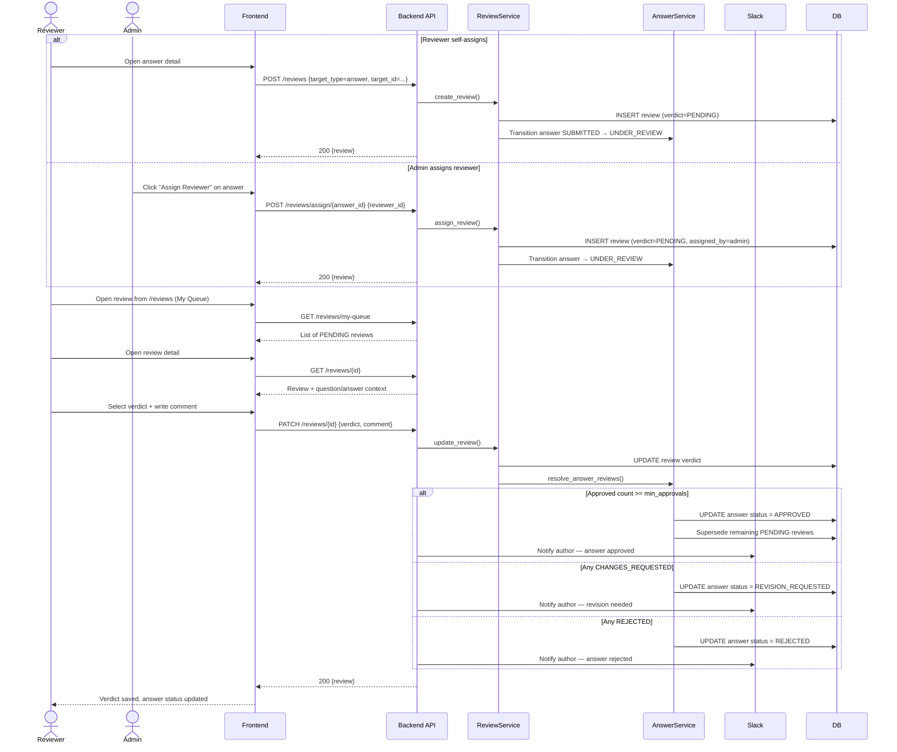
```mermaid
sequenceDiagram
    actor Reviewer
    actor Admin
    participant Frontend
    participant Backend as Backend API
    participant RService as ReviewService
    participant AService as AnswerService
    participant Slack
    participant DB

    alt Reviewer self-assigns
        Reviewer->>Frontend: Open answer detail
        Frontend->>Backend: POST /reviews {target_type=answer, target_id=...}
        Backend->>RService: create_review()
        RService->>DB: INSERT review (verdict=PENDING)
        RService->>AService: Transition answer SUBMITTED → UNDER_REVIEW
        Backend-->>Frontend: 200 {review}
    else Admin assigns reviewer
        Admin->>Frontend: Click "Assign Reviewer" on answer
        Frontend->>Backend: POST /reviews/assign/{answer_id} {reviewer_id}
        Backend->>RService: assign_review()
        RService->>DB: INSERT review (verdict=PENDING, assigned_by=admin)
        RService->>AService: Transition answer → UNDER_REVIEW
        Backend-->>Frontend: 200 {review}
    end

    Reviewer->>Frontend: Open review from /reviews (My Queue)
    Frontend->>Backend: GET /reviews/my-queue
    Backend-->>Frontend: List of PENDING reviews

    Reviewer->>Frontend: Open review detail
    Frontend->>Backend: GET /reviews/{id}
    Backend-->>Frontend: Review + question/answer context

    Reviewer->>Frontend: Select verdict + write comment
    Frontend->>Backend: PATCH /reviews/{id} {verdict, comment}
    Backend->>RService: update_review()
    RService->>DB: UPDATE review verdict
    RService->>AService: resolve_answer_reviews()

    alt Approved count >= min_approvals
        AService->>DB: UPDATE answer status = APPROVED
        AService->>DB: Supersede remaining PENDING reviews
        Backend->>Slack: Notify author — answer approved
    else Any CHANGES_REQUESTED
        AService->>DB: UPDATE answer status = REVISION_REQUESTED
        Backend->>Slack: Notify author — revision needed
    else Any REJECTED
        AService->>DB: UPDATE answer status = REJECTED
        Backend->>Slack: Notify author — answer rejected
    end

    Backend-->>Frontend: 200 {review}
    Frontend-->>Reviewer: Verdict saved, answer status updated
```

---

## 6. Answer Revision Cycle

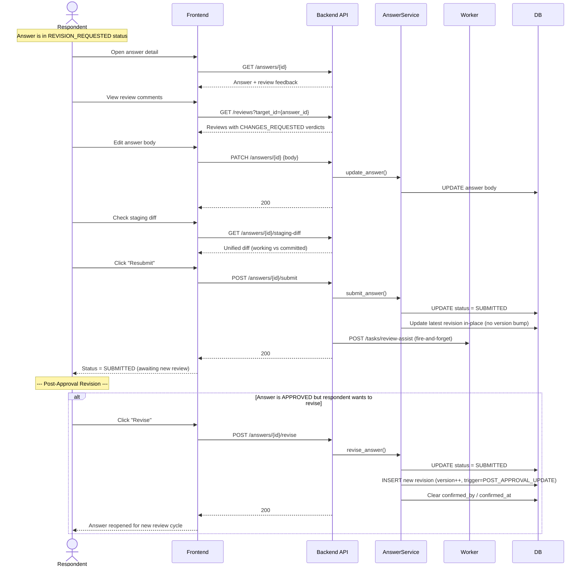
```mermaid
sequenceDiagram
    actor Respondent
    participant Frontend
    participant Backend as Backend API
    participant AService as AnswerService
    participant Worker
    participant DB

    Note over Respondent: Answer is in REVISION_REQUESTED status

    Respondent->>Frontend: Open answer detail
    Frontend->>Backend: GET /answers/{id}
    Backend-->>Frontend: Answer + review feedback

    Respondent->>Frontend: View review comments
    Frontend->>Backend: GET /reviews?target_id={answer_id}
    Backend-->>Frontend: Reviews with CHANGES_REQUESTED verdicts

    Respondent->>Frontend: Edit answer body
    Frontend->>Backend: PATCH /answers/{id} {body}
    Backend->>AService: update_answer()
    AService->>DB: UPDATE answer body
    Backend-->>Frontend: 200

    Respondent->>Frontend: Check staging diff
    Frontend->>Backend: GET /answers/{id}/staging-diff
    Backend-->>Frontend: Unified diff (working vs committed)

    Respondent->>Frontend: Click "Resubmit"
    Frontend->>Backend: POST /answers/{id}/submit
    Backend->>AService: submit_answer()
    AService->>DB: UPDATE status = SUBMITTED
    AService->>DB: Update latest revision in-place (no version bump)
    Backend->>Worker: POST /tasks/review-assist (fire-and-forget)
    Backend-->>Frontend: 200
    Frontend-->>Respondent: Status = SUBMITTED (awaiting new review)

    Note over Respondent: --- Post-Approval Revision ---

    alt Answer is APPROVED but respondent wants to revise
        Respondent->>Frontend: Click "Revise"
        Frontend->>Backend: POST /answers/{id}/revise
        Backend->>AService: revise_answer()
        AService->>DB: UPDATE status = SUBMITTED
        AService->>DB: INSERT new revision (version++, trigger=POST_APPROVAL_UPDATE)
        AService->>DB: Clear confirmed_by / confirmed_at
        Backend-->>Frontend: 200
        Frontend-->>Respondent: Answer reopened for new review cycle
    end
```

---

## 7. AI-Assisted Question Generation

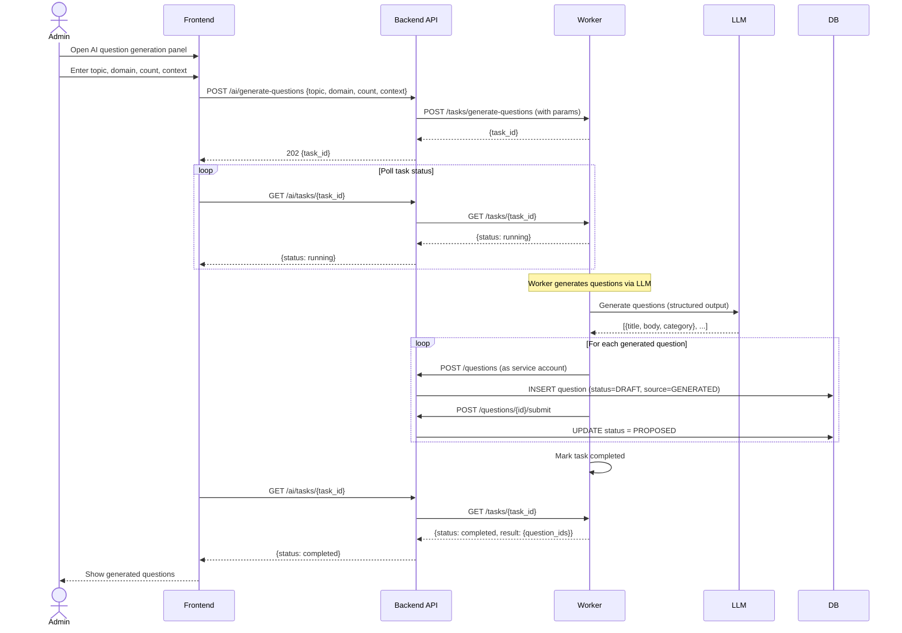
```mermaid
sequenceDiagram
    actor Admin
    participant Frontend
    participant Backend as Backend API
    participant Worker
    participant LLM
    participant DB

    Admin->>Frontend: Open AI question generation panel
    Admin->>Frontend: Enter topic, domain, count, context
    Frontend->>Backend: POST /ai/generate-questions {topic, domain, count, context}
    Backend->>Worker: POST /tasks/generate-questions (with params)
    Worker-->>Backend: {task_id}
    Backend-->>Frontend: 202 {task_id}

    loop Poll task status
        Frontend->>Backend: GET /ai/tasks/{task_id}
        Backend->>Worker: GET /tasks/{task_id}
        Worker-->>Backend: {status: running}
        Backend-->>Frontend: {status: running}
    end

    Note over Worker: Worker generates questions via LLM

    Worker->>LLM: Generate questions (structured output)
    LLM-->>Worker: [{title, body, category}, ...]

    loop For each generated question
        Worker->>Backend: POST /questions (as service account)
        Backend->>DB: INSERT question (status=DRAFT, source=GENERATED)
        Worker->>Backend: POST /questions/{id}/submit
        Backend->>DB: UPDATE status = PROPOSED
    end

    Worker->>Worker: Mark task completed

    Frontend->>Backend: GET /ai/tasks/{task_id}
    Backend->>Worker: GET /tasks/{task_id}
    Worker-->>Backend: {status: completed, result: {question_ids}}
    Backend-->>Frontend: {status: completed}
    Frontend-->>Admin: Show generated questions
```

---

## 8. AI Answer Scaffolding (Auto-trigger on Publish)

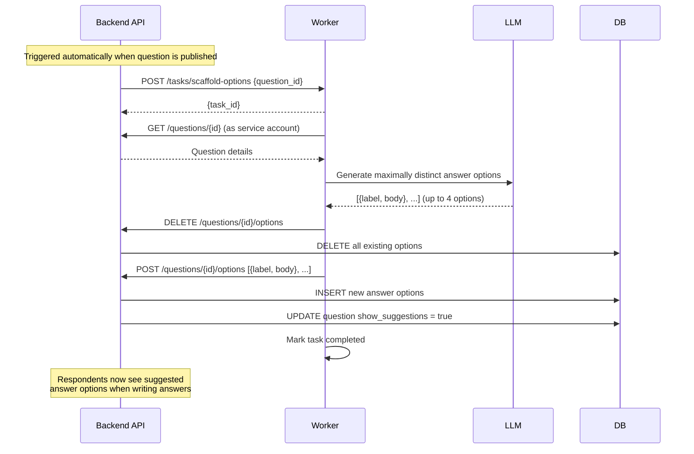
```mermaid
sequenceDiagram
    participant Backend as Backend API
    participant Worker
    participant LLM
    participant DB

    Note over Backend: Triggered automatically when question is published

    Backend->>Worker: POST /tasks/scaffold-options {question_id}
    Worker-->>Backend: {task_id}

    Worker->>Backend: GET /questions/{id} (as service account)
    Backend-->>Worker: Question details

    Worker->>LLM: Generate maximally distinct answer options
    LLM-->>Worker: [{label, body}, ...] (up to 4 options)

    Worker->>Backend: DELETE /questions/{id}/options
    Backend->>DB: DELETE all existing options

    Worker->>Backend: POST /questions/{id}/options [{label, body}, ...]
    Backend->>DB: INSERT new answer options
    Backend->>DB: UPDATE question show_suggestions = true

    Worker->>Worker: Mark task completed

    Note over Backend: Respondents now see suggested<br/>answer options when writing answers
```

---

## 9. AI Review Assistance (Auto-trigger on Submit)

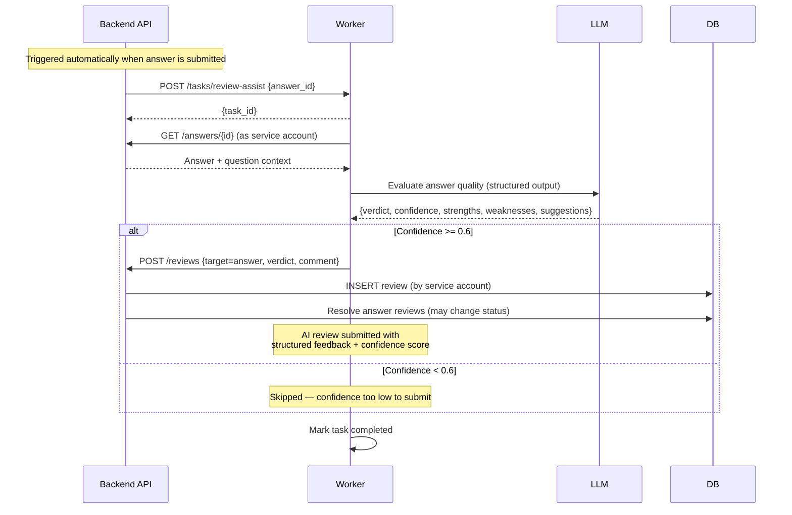
```mermaid
sequenceDiagram
    participant Backend as Backend API
    participant Worker
    participant LLM
    participant DB

    Note over Backend: Triggered automatically when answer is submitted

    Backend->>Worker: POST /tasks/review-assist {answer_id}
    Worker-->>Backend: {task_id}

    Worker->>Backend: GET /answers/{id} (as service account)
    Backend-->>Worker: Answer + question context

    Worker->>LLM: Evaluate answer quality (structured output)
    LLM-->>Worker: {verdict, confidence, strengths, weaknesses, suggestions}

    alt Confidence >= 0.6
        Worker->>Backend: POST /reviews {target=answer, verdict, comment}
        Backend->>DB: INSERT review (by service account)
        Backend->>DB: Resolve answer reviews (may change status)
        Note over Worker: AI review submitted with<br/>structured feedback + confidence score
    else Confidence < 0.6
        Note over Worker: Skipped — confidence too low to submit
    end

    Worker->>Worker: Mark task completed
```

---

## 10. Respondent Recommendation

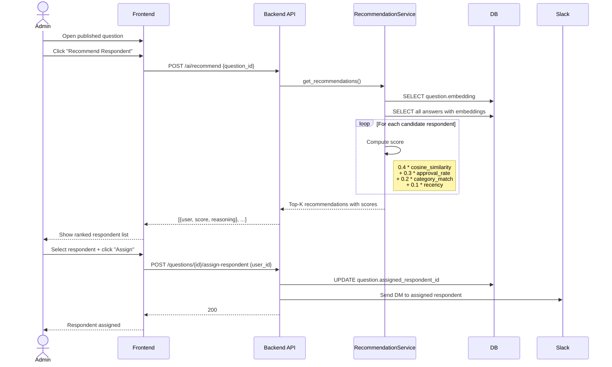
```mermaid
sequenceDiagram
    actor Admin
    participant Frontend
    participant Backend as Backend API
    participant RecService as RecommendationService
    participant DB

    Admin->>Frontend: Open published question
    Admin->>Frontend: Click "Recommend Respondent"
    Frontend->>Backend: POST /ai/recommend {question_id}

    Backend->>RecService: get_recommendations()
    RecService->>DB: SELECT question.embedding
    RecService->>DB: SELECT all answers with embeddings

    loop For each candidate respondent
        RecService->>RecService: Compute score
        Note right of RecService: 0.4 * cosine_similarity<br/>+ 0.3 * approval_rate<br/>+ 0.2 * category_match<br/>+ 0.1 * recency
    end

    RecService-->>Backend: Top-K recommendations with scores
    Backend-->>Frontend: [{user, score, reasoning}, ...]
    Frontend-->>Admin: Show ranked respondent list

    Admin->>Frontend: Select respondent + click "Assign"
    Frontend->>Backend: POST /questions/{id}/assign-respondent {user_id}
    Backend->>DB: UPDATE question.assigned_respondent_id
    Backend->>Slack: Send DM to assigned respondent
    Backend-->>Frontend: 200
    Frontend-->>Admin: Respondent assigned
```

---

## 11. Question Extraction from Document

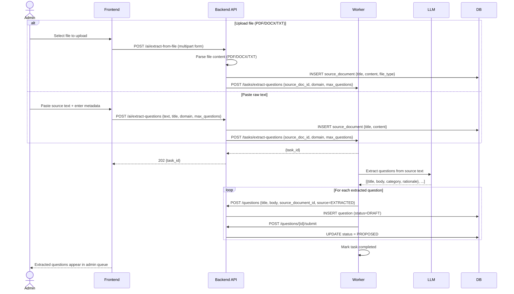
```mermaid
sequenceDiagram
    actor Admin
    participant Frontend
    participant Backend as Backend API
    participant Worker
    participant LLM
    participant DB

    alt Upload file (PDF/DOCX/TXT)
        Admin->>Frontend: Select file to upload
        Frontend->>Backend: POST /ai/extract-from-file (multipart form)
        Backend->>Backend: Parse file content (PDF/DOCX/TXT)
        Backend->>DB: INSERT source_document {title, content, file_type}
        Backend->>Worker: POST /tasks/extract-questions {source_doc_id, domain, max_questions}
    else Paste raw text
        Admin->>Frontend: Paste source text + enter metadata
        Frontend->>Backend: POST /ai/extract-questions {text, title, domain, max_questions}
        Backend->>DB: INSERT source_document {title, content}
        Backend->>Worker: POST /tasks/extract-questions {source_doc_id, domain, max_questions}
    end

    Worker-->>Backend: {task_id}
    Backend-->>Frontend: 202 {task_id}

    Worker->>LLM: Extract questions from source text
    LLM-->>Worker: [{title, body, category, rationale}, ...]

    loop For each extracted question
        Worker->>Backend: POST /questions {title, body, source_document_id, source=EXTRACTED}
        Backend->>DB: INSERT question (status=DRAFT)
        Worker->>Backend: POST /questions/{id}/submit
        Backend->>DB: UPDATE status = PROPOSED
    end

    Worker->>Worker: Mark task completed
    Frontend-->>Admin: Extracted questions appear in admin queue
```

---

## 12. Question Close & Archive Cascade

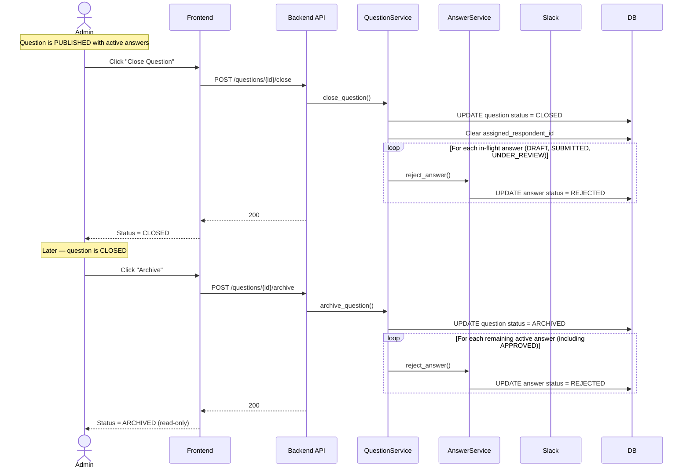
```mermaid
sequenceDiagram
    actor Admin
    participant Frontend
    participant Backend as Backend API
    participant QService as QuestionService
    participant AService as AnswerService
    participant Slack
    participant DB

    Note over Admin: Question is PUBLISHED with active answers

    Admin->>Frontend: Click "Close Question"
    Frontend->>Backend: POST /questions/{id}/close
    Backend->>QService: close_question()
    QService->>DB: UPDATE question status = CLOSED
    QService->>DB: Clear assigned_respondent_id

    loop For each in-flight answer (DRAFT, SUBMITTED, UNDER_REVIEW)
        QService->>AService: reject_answer()
        AService->>DB: UPDATE answer status = REJECTED
    end

    Backend-->>Frontend: 200
    Frontend-->>Admin: Status = CLOSED

    Note over Admin: Later — question is CLOSED

    Admin->>Frontend: Click "Archive"
    Frontend->>Backend: POST /questions/{id}/archive
    Backend->>QService: archive_question()
    QService->>DB: UPDATE question status = ARCHIVED

    loop For each remaining active answer (including APPROVED)
        QService->>AService: reject_answer()
        AService->>DB: UPDATE answer status = REJECTED
    end

    Backend-->>Frontend: 200
    Frontend-->>Admin: Status = ARCHIVED (read-only)
```

---

## 13. Service Account & API Key Auth

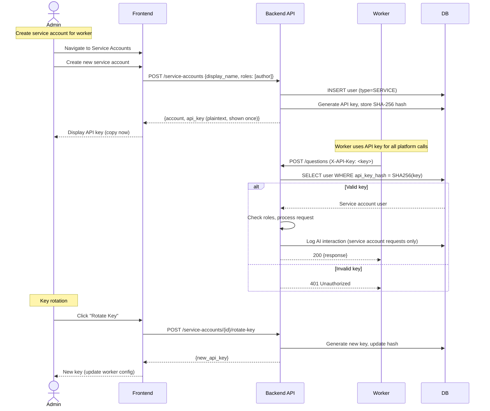
```mermaid
sequenceDiagram
    actor Admin
    participant Frontend
    participant Backend as Backend API
    participant Worker
    participant DB

    Note over Admin: Create service account for worker

    Admin->>Frontend: Navigate to Service Accounts
    Admin->>Frontend: Create new service account
    Frontend->>Backend: POST /service-accounts {display_name, roles: [author]}
    Backend->>DB: INSERT user (type=SERVICE)
    Backend->>DB: Generate API key, store SHA-256 hash
    Backend-->>Frontend: {account, api_key (plaintext, shown once)}
    Frontend-->>Admin: Display API key (copy now)

    Note over Worker: Worker uses API key for all platform calls

    Worker->>Backend: POST /questions (X-API-Key: <key>)
    Backend->>DB: SELECT user WHERE api_key_hash = SHA256(key)
    alt Valid key
        DB-->>Backend: Service account user
        Backend->>Backend: Check roles, process request
        Backend->>DB: Log AI interaction (service account requests only)
        Backend-->>Worker: 200 {response}
    else Invalid key
        Backend-->>Worker: 401 Unauthorized
    end

    Note over Admin: Key rotation

    Admin->>Frontend: Click "Rotate Key"
    Frontend->>Backend: POST /service-accounts/{id}/rotate-key
    Backend->>DB: Generate new key, update hash
    Backend-->>Frontend: {new_api_key}
    Frontend-->>Admin: New key (update worker config)
```

---

## State Machine Summary

### Question States

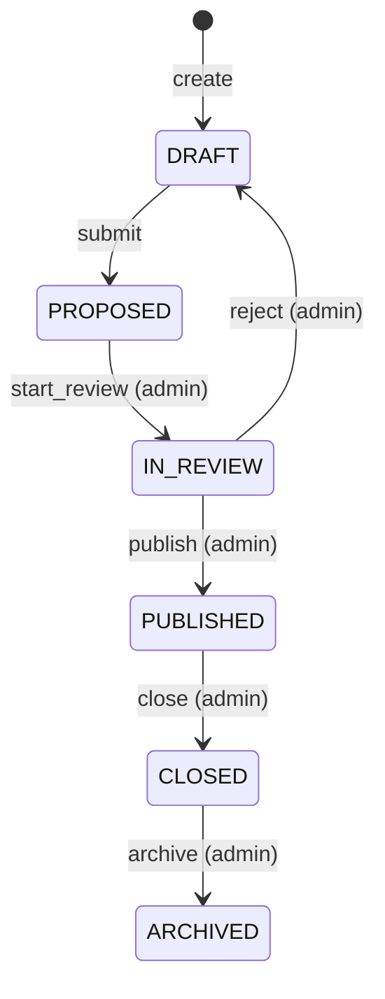
```mermaid
stateDiagram-v2
    [*] --> DRAFT: create
    DRAFT --> PROPOSED: submit
    PROPOSED --> IN_REVIEW: start_review (admin)
    IN_REVIEW --> PUBLISHED: publish (admin)
    IN_REVIEW --> DRAFT: reject (admin)
    PUBLISHED --> CLOSED: close (admin)
    CLOSED --> ARCHIVED: archive (admin)
```

### Answer States

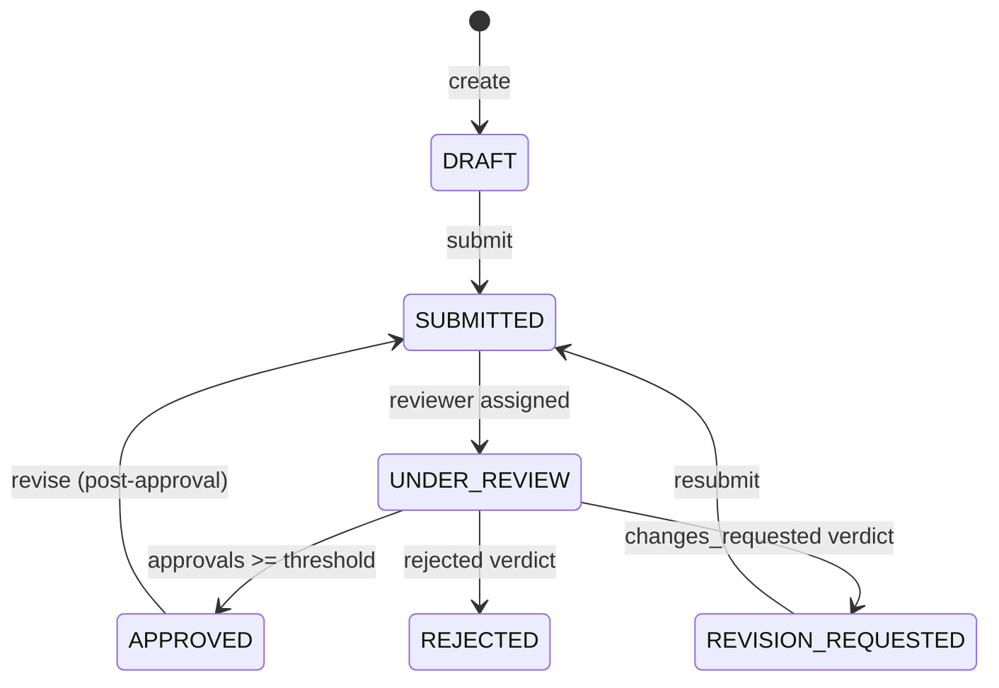
```mermaid
stateDiagram-v2
    [*] --> DRAFT: create
    DRAFT --> SUBMITTED: submit
    SUBMITTED --> UNDER_REVIEW: reviewer assigned
    UNDER_REVIEW --> APPROVED: approvals >= threshold
    UNDER_REVIEW --> REVISION_REQUESTED: changes_requested verdict
    UNDER_REVIEW --> REJECTED: rejected verdict
    REVISION_REQUESTED --> SUBMITTED: resubmit
    APPROVED --> SUBMITTED: revise (post-approval)
```

### Review Verdicts

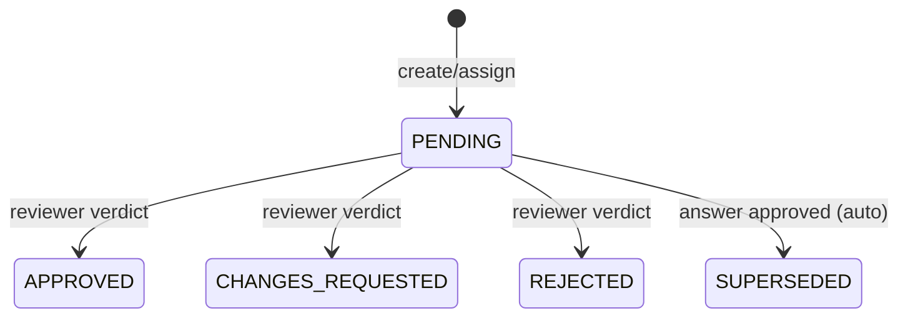
```mermaid
stateDiagram-v2
    [*] --> PENDING: create/assign
    PENDING --> APPROVED: reviewer verdict
    PENDING --> CHANGES_REQUESTED: reviewer verdict
    PENDING --> REJECTED: reviewer verdict
    PENDING --> SUPERSEDED: answer approved (auto)
```
