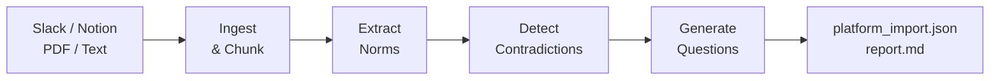

# Tacit Knowledge Mining Pipeline

Automated 4-stage pipeline: ingest sources (Slack JSON, Notion markdown, PDFs, text) → extract organizational norms → detect contradictions → generate evidence-grounded elicitation questions.

## Quick Start

```bash
# Install
cd pipeline && pip install -e ".[dev]"

# Dry run (validates config, creates run directory, no LLM calls)
python -m pipeline.run ../configs/experiments/default.yaml --dry-run

# Full run (requires API key in .env or environment)
ANTHROPIC_API_KEY=sk-... python -m pipeline.run ../configs/experiments/default.yaml

# Run tests (no API key needed — all LLM calls are mocked)
pytest tests/ -xvs
```

## Overview



- **"Change config, not code"** — prompts, models, strategies, and parameters live in `configs/`
- **Pluggable strategies** — PDF parsers, chunkers, and dedup via `@register` decorator
- **Concurrent LLM calls** — configurable parallelism per stage (default: 5)
- **Error tolerant** — failed chunks/batches are skipped, pipeline continues
- **Traceable** — every run snapshots its config + all intermediate outputs as JSONL

## Documentation

Full documentation is in the project-level `docs/` directory:

- **[Pipeline Guide](../docs/pipeline.md)** — stages, configuration, data models, architecture, cost control
- **[Architecture](../docs/architecture.md)** — system overview including where the pipeline fits

## Directory Structure

```
pipeline/
├── pipeline/
│   ├── run.py ····················· CLI entry point
│   ├── config.py ·················· ExperimentConfig (Pydantic, loads YAML)
│   ├── models.py ·················· Data types for all stages
│   ├── llm.py ····················· litellm wrapper + usage tracking
│   ├── registry.py ················ @register decorator + get_strategy()
│   ├── ingest/ ···················· Source adapters (text, slack, notion, pdf)
│   ├── parsers/ ··················· PDF parsers (pymupdf, docling)
│   ├── chunking/ ·················· Chunkers (paragraph, sliding_window)
│   ├── stages/ ···················· LLM stages (norm, contradiction, question)
│   ├── dedup/ ····················· Dedup strategies (exact, llm)
│   └── export/ ···················· Output formatters (platform_json, summary_report)
└── tests/ ························· 116 tests with fixtures
```
